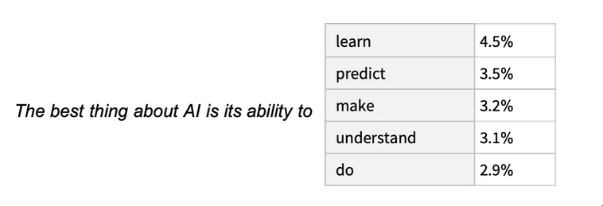

```{r, include=FALSE}
knitr::opts_chunk$set(echo = TRUE, cache = FALSE)
```


## Ablauf

\begin{minipage}{\textwidth}
   \linespread{2}
   \tableofcontents
\end{minipage}
\vspace*{3cm}

## Motivation

- (J)

# Kurzeinstieg: ChatGPT 

## Was ist GPT?

- **G**enerative **P**re-trained **T**ransformer
  - generatives Sprachmodell mit Transformer Architektur
  - Zusammensetzung von künstlichen neuronalen Netzen
- Bezeichnet eine Familie von Large Language Models (LLM)
  - Ziel: möglichst viel Trainingsdaten, um Sprache "generieren" zu können 
- Erste Version GPT-1 2018 veröffentlicht (117 Millionen Parameter) ^[ https://en.wikipedia.org/wiki/Generative_pre-trained_transformer]
  - aktuell: GPT-4, 2023 veröffentlicht
  - Vorgänger: GPT-3 mit 175 Billionen Parametern
  

## Intuition: Wie funktioniert ein LLM?

- Unupervised machine learning
  - keine explizite "Ground Truth"
  - Muster in den Trainingsdaten werden im Netz abgebildet
- Ziel: Gegeben eine Vorgeschichte $\rightarrow$ Was ist das nächst Wort?

```{r, echo=FALSE, out.width='80%', fig.align='center', fig.cap="Quelle: https://writings.stephenwolfram.com/2023/02/what-is-chatgpt-doing-and-why-does-it-work/"}

```


## Was ist ChatGPT?

# ChatGPT nutzen

## Möglichkeiten ChatGPT in einen R-Worflow zu integrieren


- WebApp 
  - chat.openai.com
  - Voraussetzungen: OpenAI Konto 
- R-Plugins (/Packages)
  - Voraussetzungen: Konto, gültigen API-Key
  - Einschränkung: Rate-Limit
  - https://cran.r-project.org/web/packages/chatgpt/index.html
  - https://github.com/jcrodriguez1989/chatgpt
  
## OpenAI API Zugriff  

- (P)
- Wie, Probleme, Pricing, Zeigen
  
## Wir zeigens Euch

- Prompts überlegen, die wir demonstrieren wollen
- Einfaches Beispielscript mit Plugin bearbeiten

# Ressourcen und Hilfe

## Nützliche Ressourcen zum Thema

- (P & J)

# Austausch

## Austausch

- Welche Erfahrung habt Ihr mit ChatGPT in Bezug auf R gemacht?
- Welche Nachteile könnte ein aktiver Gebrauch von Chat-GPT haben?
- ...

## 

\center\huge

Danke fürs Teilnehmen!


