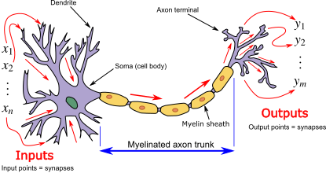

```{r, include=FALSE}
knitr::opts_chunk$set(echo = TRUE, cache = FALSE)
```

## Motivation

- ChatGPT und andere KI-Tools haben in letzter Zeit stark an Bedeutung gewonnen
  - mehr Anwendungsmöglichkeiten
  - schnellere Benutzung
  - einfacher Zugang
  - große Trainingsdatensätze

- Wir können diese Tools für unsere Arbeit mit R nutzen!
- ChatGPT kann R-Code ...
  - generieren
  - korrigieren
  - erklären
  - kommentieren
  - optimieren
- **Wir müssen wissen, wie wir am besten mit ChatGPT kommunizieren, um die gewünschten Ergebnisse zu bekommen (Prompting)**

## Ablauf

\begin{minipage}{\textwidth}
   \linespread{2}
   \tableofcontents
\end{minipage}
\vspace*{3cm}

# Kurzeinstieg: ChatGPT 

## Kleine Demonstration

- <https://platform.openai.com/tokenizer>
- <https://platform.openai.com/playground>

## Was ist GPT?

- **G**enerative **P**re-trained **T**ransformer
  - generatives Sprachmodell mit Transformer Architektur
  - Zusammensetzung von künstlichen neuronalen Netzen
- Bezeichnet eine Familie von Large Language Models (LLM)
  - Ziel: möglichst viel Trainingsdaten, um Sprache "generieren" zu können 
- Erste Version GPT-1 2018 veröffentlicht (117 Millionen Parameter) ^[ https://en.wikipedia.org/wiki/Generative_pre-trained_transformer]
  - aktuell: GPT-4, 2023 veröffentlicht
  - Vorgänger: GPT-3 mit 175 Billionen Parametern
- ChatGPT ist eine für Dialog optimierte Variante von GPT
  
## Trainingsdaten  

- Riesiger Textkorpus -> 410 Billionen Tokens

```{r, out.width='80%', fig.align='center', echo=FALSE, fig.cap="Quelle: https://katzlberger.ai/2021/04/12/mit-diesen-daten-wurde-gpt-3-trainiert/"}
knitr::include_graphics("images/GPT-3-Datenquellen.jpg")
```


## Intuition: Wie funktioniert ein LLM?

- Unupervised machine learning
  - keine explizite "Ground Truth"
  - Muster in den Trainingsdaten werden im Netz abgebildet
- Ziel: Gegeben eine Vorgeschichte $\rightarrow$ Was ist das nächst Wort?

```{r, echo=FALSE, out.width='80%', fig.align='center', fig.cap="Quelle: https://writings.stephenwolfram.com/2023/02/what-is-chatgpt-doing-and-why-does-it-work/"}
knitr::include_graphics("images/next_word.png")
```


## Intuition: künstliche Neuronale Netze

- Inspiriert vom menschlichen Gehirn

```{r, echo=FALSE, out.width='70%', fig.align='center', fig.cap="Quelle: https://upload.wikimedia.org/wikipedia/commons/4/44/Neuron3.png"}

```

## Intuition: künstliche Neuronale Netze

- Architektur eines künstlichen neuronalen Netzwerks

```{r, echo=FALSE, out.width='70%', fig.align='center', fig.cap="Quelle: https://medium.com/data-science-365/one-hidden-layer-shallow-neural-network-architecture-d45097f649e6"}
knitr::include_graphics("images/neural_network.svg")
```


## Probleme von LLMs 

- Mehrere "Layer", die nicht linear miteinander Interagieren (96 bei GPT-3)
- Outputs von mehrschichtigen neuronalen Netzen sind kaum bis gar nicht Rückführbar auf einzelne Teile des Netzwerkes
  - $\rightarrow$ Blackbox
- Sprachmodelle sind sehr rechenintensiv (sowohl Training als auch Nutzung)
  - ChatGPT kann nur serverseitig genutzt werden (Datenschutz?)

# ChatGPT nutzen

## Möglichkeiten ChatGPT in einen R-Worflow zu integrieren


- WebApp 
  - [chat.openai.com](https://chat.openai.com/)
  - Voraussetzungen: [OpenAI Konto](https://openai.com/product/chatgpt) 
- R-Packages
  - Voraussetzungen: Konto, gültigen API-Key
  - Einschränkung: Rate-Limit
  - R-Package und und RStudio-Plugin: [`chatgpt::`](https://cran.r-project.org/web/packages/chatgpt/index.html)
  
## Wir zeigens Euch: WebApp

\begin{block}{Beispiel 1}
"Wie kann ich in R einen Boxplot erstellen?"
\end{block}

\begin{block}{Beispiel 2}
"Ich habe einen Datensatz mit den Variablen einkommen, geschlecht und ost\_west. einkommen ist nummerisch, geschlecht ein Faktor mit den Ausprägungen "männlich" und "weiblich" und ost\_west ein Faktor mit den Ausprägungen "ost" und "west". Wie kann ich aus diesen Variablen einen Boxplot in R erstellen? Ich möchte das Paket ggplot2 verwenden. Auf der y-Achse soll das Einkommen abgebildet werden, auf der x-Achse das Geschlecht. Die Farbe der Boxplots soll nach der Variable ost\_west variieren. Erstelle einen Beispieldatensatz. Kommentiere den ausgegebenen Code."
\end{block}

## Tipps für's Prompting

- gebt ChatGPT so spezifische Anweisungen wie möglich:
  - Welche Packages?
  - Welche Datentypen?
  - Wie soll das Ergebnis aussehen?
  - Wie lautet die Fehlermitteilung?

- Oft ist Codegeneration mit ChatGPT iterativ:
  1) Initialer Prompt
  2) erster generierter Code
  3) Code testen
  4) ChatGPT auf Fehler hinweisen oder Prompt entsprechend anpassen
  5) Schritt 3) und 4) wiederholen, bis Code wie erwartet läuft

## Was ist eine API?

  - API -> Application Programming Interface
    - ist eine vom Betreiber der Anwendung bereitgestellte Schnittstelle
  - Oft an einen sogenannten API-Key gebunden, über welchen man sich authentifiziert  

  
    
## OpenAI API Zugriff  

- Anmeldung bei [\textcolor{blue}{OpenAI}](https://platform.openai.com/signup) erforderlich
- $5 Startguthaben, aber nur für die ersten 3 Monate
- Rate Limits für Startguthaben: 3 requests per minute
- Danach muss Zahlungsmittel hinterlegt werden, für weiter Nutzung. Kosten^[https://openai.com/pricing]:
  - GPT-4, 8K context, Prompt: $0.03/1K tokens
  - GPT-3.5-turbo: $0.002/1K tokens 
- Für R-Package `chatgpt` ist API-Key erforderlich
  
  
## Wir zeigens Euch: Plugin `chatgpt`

- API-Key als globale Systemvariable **OPENAI_API_KEY** abspeichern
- Plugin und `chatgpt`-Funktionen nun nutzbar
- Funktionsweise: Package sendet markierten Code und vorgefertigten Promt über die API an ChatGPT
- Einfaches Beispielscript mit Plugin bearbeiten

# Austausch

## Austausch

- Welche Erfahrung habt Ihr mit ChatGPT in Bezug auf R gemacht?
- Welche Nachteile könnte ein aktiver Gebrauch von Chat-GPT haben?
- Wie reproduzierbar sind Antworten von ChatGPT, was bedeutet das für die Forschung?

## 

\center\huge

Danke fürs Teilnehmen!


