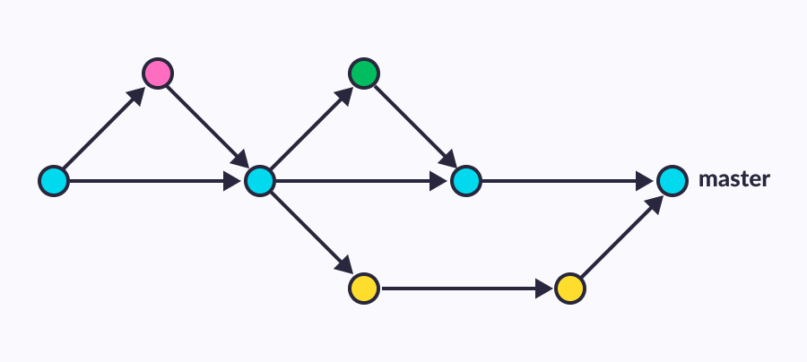

```{r, include=FALSE}
knitr::opts_chunk$set(echo = TRUE, cache = FALSE)
```


## GetTogetheR

- monatliche Veranstaltung (jeden 2. Donnerstag im Monat)
- kurze Inputvorträge von uns oder unseren Gästen
- aktuelle Themen rund um R und RStudio:
  - Git und R (13.04.2023)
  - Netzwerkanalyse in R [Till Hovestadt] (11.05.2023)
  - ChatGPT als R-Copilot (08.06.2023)
  - Hausarbeiten mit RMarkdown (13.07.2023)
- aktueller Syllabus im [\textcolor{blue}{Moodlekurs}](https://moodle2.uni-leipzig.de/course/view.php?id=41052)

## Ablauf

\begin{minipage}{\textwidth}
   \linespread{2}
   \tableofcontents
\end{minipage}
\vspace*{3cm}

## Motivation

- Git entwickelt sich zum Standard für viele Anwendungsfelder
  - Kollaboration
  - Sicherung von Projekten (Backup)
  - Dokumentation
- RStudio bietet gute und einfache Möglichkeit zur Versionskontrolle via Git
- Funktion ist oft nicht Teil von Einführungskursen und wird daher wenig genutzt

# Kurzeinstieg: Git

## Was ist Git?

```{r, echo=FALSE, out.width='23%', fig.align='left'}
knitr::include_graphics("git_logo.png")
```


>- Programm zur Versionskontrolle 
>  + kann komplett lokal genutzt werden 
>  + kommt ohne grafische Oberfläche 
>    + mögliche GUIs: [\textcolor{blue}{GitHub Desktop}](https://desktop.github.com), [\textcolor{blue}{Source Tree}](https://www.sourcetreeapp.com), [\textcolor{blue}{GitKraken}](https://www.gitkraken.com/), bzw. RStudio 
>  + Änderungen werden Schrittweise durchgeführt (`git commit`)
>  + Änderungen können Rückgängig gemacht werden (`git restore`)
>  + Ältere Versionen des Projekts können wieder hergestellt werden (`git reset`)
>  + Verschiedene Versionen des Projekts können parallel bearbeitet werden und später zusammengeführt (Branching -> `git checkout`, Merging -> `git merge`)


## Git Branching  

```{r, echo=FALSE, out.width='80%', fig.align='center', fig.cap="Inkrementale Arbeit an einem Projekt"}

```

## Git Hoster (Remote Git-Repository)

```{r, echo=FALSE, out.width='50%', fig.align='center', fig.cap="Zusammenarbeit über ein Remote Repository"}

```

- Git-Hoster: [\textcolor{blue}{GitHub}](https://github.com/), [\textcolor{blue}{GitLab}](https://about.gitlab.com/), [\textcolor{blue}{Gitea}](https://gitea.io/en-us/), ...

## GitHub Basics

- Beispiel: \textcolor{blue}{https://github.com/tidyverse}
- **Repository** $\rightarrow$ Verzeichnis mit allen Projektdateien und Git-Verwaltungsdateien (Kann öffentlich oder privat sein)
- **Branches** $\rightarrow$ Abzweigungen vom Hauptentwicklungsstand, z.B. für mehrere Änderungen oder Änderungsvorschläge 
- **Commit** $\rightarrow$ Eine Änderung innerhalb einer Branch
- `README.md` $\rightarrow$ Projektbeschreibung und Informationen
- **History** $\rightarrow$ Änderungsverlauf einer Datei
- **Issues** $\rightarrow$ Anregungen, Änderungsvorschläge, Kritik, etc.
- **Pull requests** $\rightarrow$ Externe Änderungsvorschlag, der in eine Branch übernommen werden soll
- **Clone** $\rightarrow$ Aktuellen Stand als *lokale* Kopie auf dem eigenen Rechner anlegen

## Git Workflow (vereinfacht)

\begin{enumerate}
  \item Remote Repository anlegen.
  \item Lokal clonen.
  \item Änderungen durchführen. 
  \item Änderungen commiten (Zum aktuellen Entwicklungsstand hinzufügen).
  \item Änderungen pushen (Ins Remote-Repository übertragen).
\end{enumerate}

- *Wichtig*: Immer aktuellen Stand pullen, bevor man eigene Änderungen vornimmt

# Setup mit RStudio

## Git und RStudio

- Was brauch man alles?
  - [Git](https://git-scm.com/downloads) auf dem Rechner installiert
  - Account bei einem Git-Hoster (bspw. GitHub)
  - bestehendes Git-Repository
  
\vspace*{0.6cm}

- Schritte:
  - neues R-Projekt erstellen 
  - Version Control
  - URL des Repositorys angeben
  
## Wir zeigen's Euch

```{r, echo=FALSE, out.width='50%', fig.align='center'}
knitr::include_graphics("present.png")
```

## Limitationen

- GitHub ist nicht für große Daten gedacht (Filelimit 100MB)
- man muss Änderungen regelmäßig pushen, sonst hat man nichts gewonnen
- bei Problemen (gerade beim Kollaborieren) muss man sich näher mit Git auseinandersetzen (merge conflicts)

## Warum sich die Mühe machen? 

\begin{columns}
\begin{column}{0.5\textwidth}
   \begin{itemize}
      \item Änderungen tracken, dokumentieren und rückgängig machen 
      \item gleichzeitig im Team zusammenarbeiten und Änderungen zusammenführen
      \item Projekte sicher abspeichern 
      \item GitHub bietet unglaublich viel Potential für weitere Anwendungsfälle (Aufgabenplanung in Projekten, Releases, Continuous deployment von \href{https://bookdown.org/yihui/bookdown/github.html}{\textcolor{blue}{Bookdown}} Dokumenten, ...)
   \end{itemize}
\end{column}
\begin{column}{0.5\textwidth}
    \begin{center}
     \includegraphics[width=1\textwidth]{final_doc.png}      
     \end{center}
\end{column}
\end{columns}


# Ressourcen und Hilfe

## Nützliche Ressourcen zum Thema

- \textcolor{blue}{https://r-bio.github.io/intro-git-rstudio/} (Einstiegs Tutorial)
- \textcolor{blue}{https://posit.co/resources/videos/managing-part-2-github-and-rstudio/} (Video zum Einstieg)
- \textcolor{blue}{https://happygitwithr.com/} (Umfassende Referenz)

# Austausch

## Austausch

- Welche Erfahrung habt Ihr mit Git und RStudio? Tipps? Tricks?
- Habt Ihr Ideen für eigene Anwendungsfälle? Wofür wollt Ihr die RStudio-Integration von Git benutzen?
- Öffentliche Git-Repos als gute wissenschaftliche Praxis, um Reproduzierbarkeit zu gewährleisten?

## Austausch

- Ausprobieren?

## 

\center\huge

Danke fürs Teilnehmen!

## Bildquellen

- https://geniusee.com/storage/app/media/blog/blog223_git_branching_model/GitHub_Flow.png
- https://git-scm.com/images/logo@2x.png
- https://www.inflectra.com/Images/Product-Imagery/Git.png
- https://www.freepik.com/free-icon/business-presentation_772083.htm
- https://phdcomics.com/comics/archive_print.php?comicid=1531


