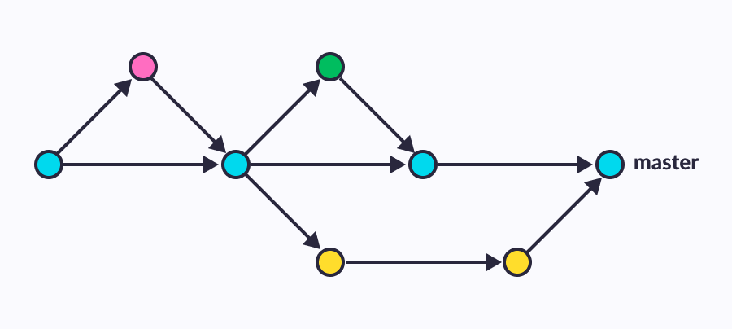

```{r, include=FALSE}
knitr::opts_chunk$set(echo = TRUE, cache = FALSE)
```


## Ablauf

\tableofcontents

## GetTogetheR

- Veranstaltung vorstellen

## R und Git

- Wie kommen wir auf das Thema
- Was wir machen (Kurzeinstieg zum Thema, Sammeln und Bereitstellen von Ressourcen zum Einstieg)
- Was wir nicht machen (Tutorial zum mitmachen)

## Was ist Git?

```{r, echo=FALSE, out.width='23%', fig.align='left'}
knitr::include_graphics("git_logo.png")
```


- Programm zur Versionskontrolle
  - kann komplett lokal genutzt werden
  - Änderungen werden Schrittweise durchgeführt (Commits)
  - Änderungen können Rückgängig gemacht werden (revert)
  - Ältere Versionen des Projekts können wieder hergestellt werden
  - Verschiedene Versionen des Projekts können gleichzeitig bearbeitet werden und später zusammengeführt (Branching)
  
## Git Branching  

```{r, echo=FALSE, out.width='80%', fig.align='center', fig.cap="Inkrementale Arbeit an einem Projekt"}

```

## Git Hoster (Remote Git-Repository)

```{r, echo=FALSE, out.width='50%', fig.align='center', fig.cap="Zusammenarbeit über ein Remote Repository"}
knitr::include_graphics("git_commiting.png")
```

- Git-Hoster: [\textcolor{blue}{GitHub}](https://github.com/), [\textcolor{blue}{GitLab}](https://about.gitlab.com/), [\textcolor{blue}{Gitea}](https://gitea.io/en-us/), ...

## Git und RStudio

- Was brauch man alles? (Account bei einem Git-Hoster, SSH/GPG-Keys, Git auf dem Rechner, aktuelle RStudio Version, ...)

## Warum sich die Mühe machen? 

- ...

## Diskussion

- Frage: welche Erfahrung habt Ihr zum Thema R und Git gemacht?

## Nützliche Ressourcen zum Thema

- https://r-bio.github.io/intro-git-rstudio/ (Einstiegs Tutorial)
- https://posit.co/resources/videos/managing-part-2-github-and-rstudio/ (Video zum Einstieg)
- https://happygitwithr.com/ (Umfassende Referenz)

## Bildquellen

- https://geniusee.com/storage/app/media/blog/blog223_git_branching_model/GitHub_Flow.png
- https://git-scm.com/images/logo@2x.png
- https://www.inflectra.com/Images/Product-Imagery/Git.png


